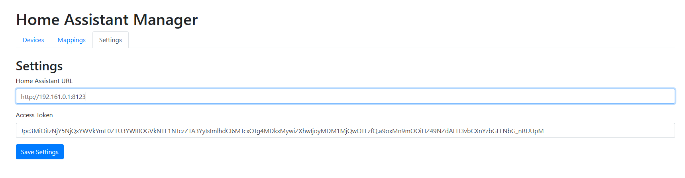

# Node-RED Home Assistant Three-Way Switch Manager

This project is a web application designed to help users manage their Home Assistant devices and mappings, focusing on creating virtual three-way switch setups and virtual parallel switch setups throught Node-RED. The application allows users to independently manage their own device configurations and mappings.

## Features

- **Device Management**:
  - Fetch Home Assistant devices and entities.
  - Display devices in a table format.
  
- **Mapping Management**:
  - Create mappings between source and target devices/entities.
  - Display mappings in a table format.
  - Enable three-way switch setup with a checkbox.
  - Highlight duplicate mappings.
  - Prevent mappings with identical source and target entities.
  
- **Configuration Management**:
  - Update Home Assistant configuration settings (URL and access token) via a settings page.

## Requirements

- Python 3.8 or higher
- Home Assistant with relevant devices configured
- Node-RED installed in Home Assistant
- (optional) Node-RED node: [@bartbutenaers/node-red-autolayout-sidebar](https://flows.nodered.org/node/@bartbutenaers/node-red-autolayout-sidebar "@bartbutenaers/node-red-autolayout-sidebar")

`pip install -r requirements.txt` to install the libraries.

### Configuration

#### Development

1. Update the `config.yaml` file with your Home Assistant URL and access token:

    ```yaml
    home_assistant:
      home_assistant_url: 'http://your-home-assistant-url:8123'
      access_token: 'your-access-token'
    ```


2. Run app using the command below:

```sh
flask run
```

### Directory Structure

```plaintext
node-red-homeassistant-three-way/
│
├── app/
│   ├── __init__.py
│   ├── routes.py
│   ├── templates/
│   │   ├── index.html
│   │   ├── devices.html
│   │   ├── mappings.html
│   │   └── settings.html
│   ├── static/
│   │   ├── styles.css
│   │   └── scripts.js
├── scripts/
│   ├── get_ha_devices_entities.py
│   ├── check_mapping.py
│   ├── main.py
├── config.py
├── run.py
├── requirements.txt
├── config.yaml
├── mappings.csv
└── devices.csv
```

## How to use

### Accessing the Application

1. Navigate to the application's URL in your web browser (e.g., `http://127.0.0.1:5000` for local development).

### Configuration Management

1. Go to the "Settings" tab.
2. Update the Home Assistant URL and access token.
3. Save the settings.



### Device Management

1. Go to the "Devices" tab.
2. Click "Fetch Devices" to retrieve the latest devices from your Home Assistant (after a success message appear, refresh the page manually).
3. The devices will be listed in the table. You can also download the `devices.csv` file.


### Mapping Management

1. Go to the "Mappings" tab.
2. Add a new mapping by selecting source and target devices and entities.


3. Enable the "Three Way" option if needed by checking the checkbox. You will notice that a new row will be added with entities in reverse (will turn on and turn off in both ways).


4. Save the mappings.
5. The mappings will be listed in the table. You can also download the `mappings.csv` file.

### Node-RED Flow

1. After everything is done, click on `Run Main Function` button to generate a Node-RED Flow JSON


2. Go to Node-RED, click on [Import](https://nodered.org/docs/user-guide/editor/workspace/import-export) and paste the generated JSON
3. After you manage to paste and create a new flow, you will see something like this:


4. I would suggest to do the following:
- 4.1. CTRL + A (Select all)
- 4.2. Install Auto Layout is suggested above in this doc
- 4.3. Click on `Execute auto-layout` button

You will see the magic happening and will look something like this:


## Contributing

Contributions are welcome! Please fork the repository and submit a pull request.

## Acknowledgements

- Home Assistant: https://www.home-assistant.io/
- Node-RED: https://nodered.org/
